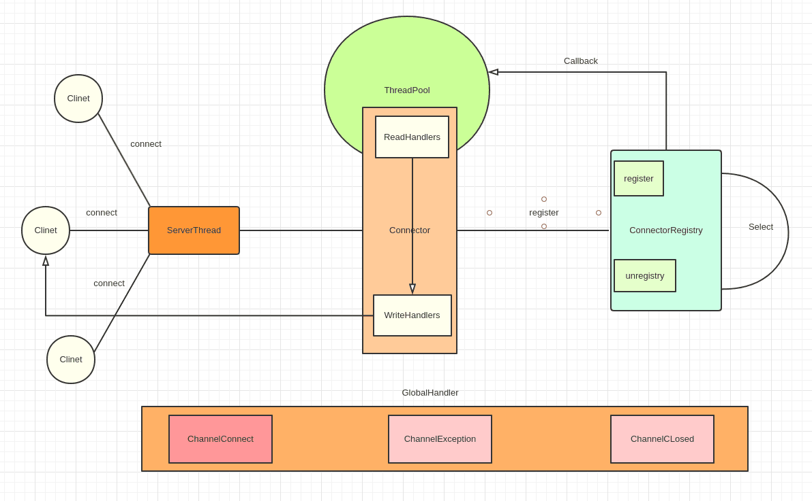

# 高性能网关设计大赛作品
基于原生NIO  Socket编写  
用到的依赖有
- lombok
- cglib
- logback
- sl4j
## 使用
#### 环境要求
- linux
- jdk8或以上 
#### 直接使用start.sh脚本
1. `chmod +x start.sh`
2. `sh start.sh`
####直接运行jar包
1. `java -jar GatewayChallenge-1.0.jar 10`
## 整体架构

#### 主要组件
- ServerConfiguration和ServerContext
ServerConfiguration里存储着应用的一些配置，如服务端口号等。ServerContext是一个单利的对象，用于在项目里获取这些配置
- ServerBootstrap
应用启动引导，需要在这里初始化ServerContext，然后启动应用
- Connector
对SocketChannel的封装，里面除了含有SocketChannel还含有InputHandlerChain和OutputHandlerChain，
以及封装好的close方法等
- InputHandler和InputHandlerChain
当有消息来临时会回调InputHandlerChain的doChainHandler方法，该方法会调用位于头部的handler，
消息是否往后传递取决与当前Handler是否调用了定义好的deliveryNextHandler模板方法
- ConnectorStatusChangeHandler
该接口的实现全局应该只有一个，当有新的连接来临，连接关闭，连接处理消息出现异常，都会回调该接口的相应方法
- ConnectorRegistry
Connector注册中心，当Connector向注册中心注册后，connector有新消息来临的话会自动调用该connector的InputHandlerChain，
其核心是一个Selector

#### 一个连接的生命过程
ServerBootstrap启动后，会有一个专门的线程来监听客户端的连接，当获取到客户端的连接后，便会根据系统配置
生成一个Connector对象对其封装，同时回调ConnectorStatusChangeHandler的新连接到来接口，之后便会将该Connector注册到
ConnectorRegistry中，ConnectorRegistry工作在一个单独的线程，通过循环进行select操作来监听新消息来临，
当有新消息来临的时候会把该连接扔到一个线城池里来进行异步读和handler回调。这期间如果出现了异常会回调
ConnectorStatusChangeHandler接口。当该Connector调用其close方法时会将其移除ConnectorRegistry同时回调
ConnectorStatusChangeHandler接口。